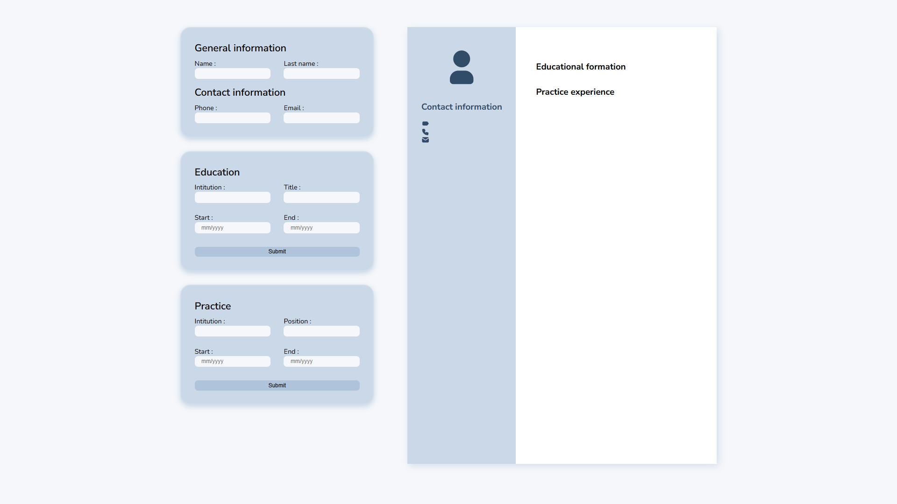

# CV Application

This project is a React-based CV (Curriculum Vitae) application. Users can input, edit, and preview their personal information, education, and work experience to generate a professional CV. The application demonstrates key React concepts such as state management, component structure, and controlled forms.

# Preview

[View Live Preview](https://cvapplicationbyvicker.netlify.app/)

# Future features

- Default fill
- Toggle form sections visibility
- More parameters (link to website)
- More sections
- Input verification